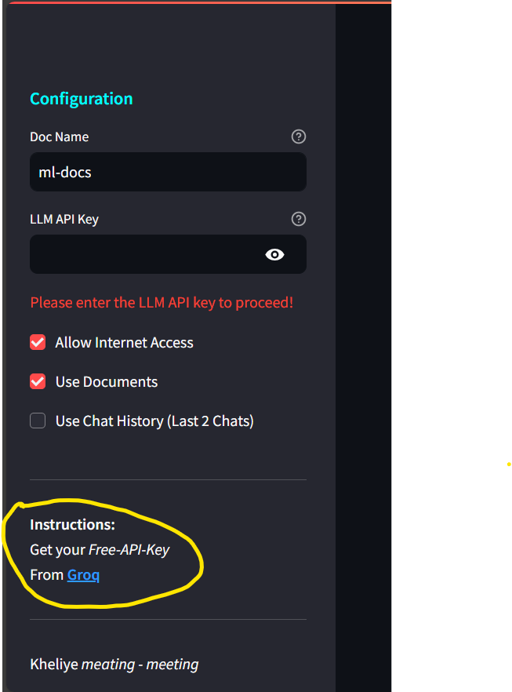

# 📚 Bhala Manus - No Back Abhiyan  

Bhala Manus is a multimodal AI assistant powered by Groq and Google Generative AI models. This tool enables seamless interaction through text and image inputs, providing insightful responses by leveraging LLM capabilities, vector databases, and web search integrations.  

## ⚙ Features  
- **Multimodal Interaction**: Supports both text and image inputs for a diverse range of queries.  
- **Advanced AI Models**: Built on Groq's `llama-3.1-70b-versatile` and `Google Generative AI` for insightful responses.  
- **Contextual Responses**: Leverages chat history, vector databases, and web data for accurate answers.  
- **Vector Database Integration**: Connects to Pinecone for storing and retrieving document embeddings.  
- **Customizable Sidebar Options**: Configure API keys, chat history usage, and web access settings.  

---

## 🛠️ Tech Stack  
- **Frontend**: Streamlit for interactive web-based UI.  
- **LLM Models**: Groq and Google Generative AI (`gemini-1.5-flash`, `embedding-001`).  
- **Vector Database**: Pinecone for similarity searches.  
- **Utilities**: PIL for image handling, DuckDuckGo Search API for web queries.  

---

## 📂 Folder Structure  
```plaintext
project/
│
├── src/
│   ├── main.py              # Main application file
│   ├── utils.py             # Utility functions
│   └── config.py            # Configuration file for constants and settings
├── requirements.txt         # Python dependencies
└── README.md                # Project documentation
```
## 📦 Installation
Clone the Repository
```
git clone https://github.com/subh-775/Bhala-Manus.git
cd Bhala-Manus
```
## Install Dependencies
```
pip install -r requirements.txt
```
## Run the Application
```
streamlit run src/main.py
```
## 📝 Usage
Features at a Glance :
- **Text Input:** Enter queries directly into the text input field.
- **Image Analysis:** Upload images to extract meaningful insights or queries.
- **Sidebar Configurations:**
  1. Create and enter your Groq API Key and other required credentials.You can create your api by clicking on side panel and going down here:
     

  3. Enable or disable vector database, web search, or chat history usage.
- You can also use the model here at : <a href="http://Good-boy.streamlit.app">Here</a>

## Input Examples
- **Text Query:** "Explain the concept of transformers in ML."
- **Image Query:** Upload an image containing text or data and provide a relevant query.
- 
## 🔑 Configuration
- Required API Keys
- Groq API Key: Get your free API key from Groq.
- Pinecone API Key: Obtain the key from your Pinecone dashboard.
- Google Generative AI API Key: Set up your key for embedding and generative tasks.
- Add these keys to the sidebar during runtime.

🤝 Contributing
Contributions are welcome! Please follow these steps:

Fork the repository.
Commit your changes and push to the branch.
Create a Pull Request.

📝 License
```text
Apache License 2.0

Licensed under the Apache License, Version 2.0 (the "License");
you may not use this file except in compliance with the License.
You may obtain a copy of the License at

   http://www.apache.org/licenses/LICENSE-2.0

Unless required by applicable law or agreed to in writing, software
distributed under the License is distributed on an "AS IS" BASIS,
WITHOUT WARRANTIES OR CONDITIONS OF ANY KIND, either express or implied.
See the License for the specific language governing permissions and
limitations under the License.
```

## 🌟 Acknowledgments
Groq and Google Generative AI for providing cutting-edge AI solutions.
Pinecone for enabling fast and scalable vector database operations.
Streamlit for its simple and elegant UI framework.
